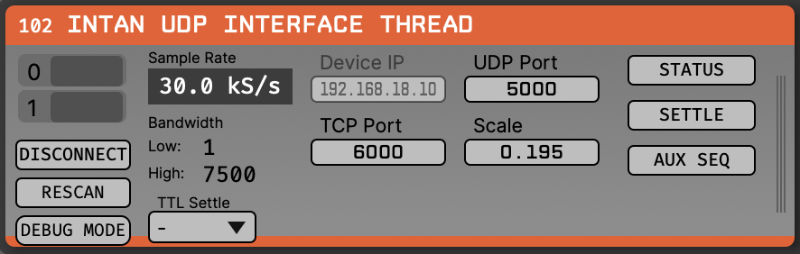

# Intan Socket (MicroZed fork of Ephys Socket)

An Open Ephys GUI `DataThread` plugin for the **MicroZed/Zynq-7020 Intan
acquisition system** ([MicroZedIntanInterface](https://github.com/kemerelab/MicroZedIntanInterface)).
Forked from the original [Ephys Socket](https://github.com/open-ephys-plugins/ephys-socket)
by Jonathan Newman ([@jonnew](https://github.com/jonnew)); this fork replaces the
generic matrix-over-TCP source with the MicroZed device protocol:

- **TCP control** (port 6000): start/stop, configuration, chip auto-detection,
  and the aux-sequencer commands (below). `IntanInterface.{h,cpp}` is a
  standalone C++ client for this protocol (no JUCE dependency) — it is the
  third consumer of the register/packet contract, after the firmware and
  `remote/net.py`.
- **UDP data** (port 5000): one packet per ~30 kHz sample; 10 header words +
  up to 70 data words depending on the channel-enable mask.

<p align="center">
  
</p>

The board firmware, the `remote/net.py` reference client, and this plugin are
the **three consumers of the same register/packet contract** — see the
MicroZed repo when changing the protocol.

## Usage

1. **Flash the board** with a current MicroZed image (`blobs/BOOT.bin` from the
   MicroZedIntanInterface repo) and put it on the network. Default device IP is
   `192.168.18.10`; put your host on the same subnet (port 6000 TCP control,
   5000 UDP data).
2. **Install the plugin** (see *Building from source* below) so OpenEphys finds
   it in its `plugins` directory.
3. In OpenEphys, open the **Processor List → Sources** and drag **Intan Socket**
   in as the signal-chain source.
4. In the editor, set **Device IP** (and TCP/UDP ports if non-default), then
   click **CONNECT**. On success the chip indicators light and the STATUS /
   SETTLE / AUX SEQ buttons enable.
5. Click **RESCAN** to auto-detect the connected chip(s) and the optimal cable
   phase; the channel count updates to match.
6. Press **play** to stream. Neural channels appear as `CH1…`, aux inputs as
   `AUX0_1…` (per CIPO line). Click **STATUS** at any time to dump full device
   state to the console (View → **Console**, or Shift+C in a Release build).
7. To exercise the run-time features: **SETTLE** toggles amplifier fast settle;
   the **TTL Settle** dropdown makes fast settle follow a digital-input pin;
   **AUX SEQ** switches the aux slots to the banked accelerometer/housekeeping
   programs (and, toggled while streaming, performs a live bank swap).

A connected **headstage accelerometer** (auxin1/2/3) shows up on the AUX
channels — select the **AUX** channel type in the LFP viewer's range selector
to see it at the right scale.

## Editor controls

| Control | When | What |
|---|---|---|
| CONNECT / DISCONNECT | idle | open/close the TCP+UDP connection |
| RESCAN | idle | chip auto-detection (phase sweep, chip ID, channel mask) |
| DEBUG MODE | idle | device-generated sine data (128 channels) |
| **STATUS** | **any time** | print the full device status to the GUI console, including the aux-sequencer block (enabled/fast-settle/digout/DSP flags, active banks, per-slot indices, last injected-command result) |
| **SETTLE** | **any time** | toggle amplifier fast settle (RHD Reg-0 D5). The PL injects `WRITE(0,0xFE)` / `WRITE(0,0xDE)` into the slot-0 aux position on the transition packet. Datasheet pulse guidance is ~2.5/f_H (≈250 µs at 7.5 kHz upper cutoff) — toggle off promptly |
| **AUX SEQ** | **any time** | switch the 3 aux COPI positions to the banked sequencer programs (see below). Toggling while acquiring uploads the **standby** banks and swaps them atomically at a packet boundary — exercising the live double-buffer path |
| TTL Settle | any time | fast settle follows the selected `digital_in` pin (TTL1–8 → pins 0–7); "-" disables. Combined (OR) with the SETTLE button's software level |

STATUS, SETTLE, AUX SEQ, and TTL Settle are deliberately usable **during
acquisition** — they exist to validate the firmware's runtime-control paths.
SETTLE and TTL Settle auto-enable the aux sequencer if it is off (the override
layer only reaches the chip while the sequencer is enabled).

## Aux sequencer mode and accelerometer de-interleaving

Firmware `aux-seq-v2` can source the three aux COPI cycles (32–34) from
programmable, double-buffered command banks. AUX SEQ loads the default
programs (mirroring `remote/net.py`):

- **slot 0** (cycle 32, real-time): a `WRITE(3, …)` carrier, rewritten every
  packet by the PL's Reg-3 shadow (digout mirror); also the fast-settle
  injection point
- **slot 1** (cycle 33, ADC): accelerometer sweep `CONVERT(32) → (33) → (34)`,
  looping — **one axis per packet**, i.e. 10 kHz per axis
- **slot 2** (cycle 34, housekeeping): supply voltage, temperature, chip ID,
  and the `INTAN` ROM string, looping

Packets are **self-describing**: header word 4 carries
`{echo_slot0[15:0], aux_flags[7:0], digital_in[7:0]}` and word 5 carries
`{echo_slot2[31:16], echo_slot1[15:0]}` — the *originating command* for each
aux result in the packet. Because of the chip's 2-command SPI pipeline, the
result of slot 0's command is at data word 34 of the *same* packet, and the
results of the *previous* packet's slot-1/2 commands are at data words 0 and 1.

`IntanSocket::updateBuffer()` uses the per-packet flags (not local state) to
pick the parse mode, so it stays correct through live bank swaps:

- sequencer **off**: legacy format — all three aux inputs converted every
  packet (results at cycles 34/0/1), passed straight to the AUX channels
- sequencer **on**: data word 0 holds one accelerometer axis per packet,
  identified by the slot-1 echo; the plugin de-interleaves by echo into the
  3 AUX channels with sample-and-hold (each axis updates at 10 kHz, buffered
  at the 30 kHz stream rate). The `echo_valid` flag gates the first packet
  after a start (its word-0/1 results belong to the previous run).

The AUX channel count and packet size are identical in both modes, so no
signal-chain rebuild is needed when toggling.

Status responses are 98 bytes on aux-seq-v2 firmware; the plugin also accepts
the older 86-byte form (aux features then report "not supported").

The authoritative protocol documentation lives in the MicroZedIntanInterface
repo: `docs/command-bank-design.md` (design), `docs/NIGHT_LOG-2026-06-11.md`
(implementation + verification), and `firmware/include/main.h` (register map).

## Channel scaling and data storage

Scaling matches the OpenEphys **acquisition-board plugin** exactly. Every
sample is published into the GUI data buffer as:

```
buffer_value = (raw_adc_count - 32768) * bitVolts
```

and the **same `bitVolts`** is declared on the channel:

| Channel type | bitVolts | buffer units | units label |
|---|---|---|---|
| ELECTRODE (neural) | `0.195` | µV | `uV` |
| AUX (auxin1/2/3, e.g. accelerometer) | `0.0000374` | — | `mV` |

The `- 32768` decodes the chip's offset-binary samples to a signed value
around zero; it is a constant, reversible representation choice (the same one
the acquisition board makes), **not** a baseline subtraction or detrend — no
acquired information is altered or lost.

### What this means for recordings

The Binary record engine converts each float back to `int16` as
`int16 = buffer_value / bitVolts` (clamped to ±32767). Because the buffer value
is `(raw - 32768) * bitVolts` and the channel's `bitVolts` is that same factor,
the division cancels exactly:

```
int16_on_disk = (raw - 32768)
```

So the recording stores the **exact signed ADC count** (`raw - 32768`, range
−32768…+32767 — precisely the int16 range, so it never clips), and the
`bit_volts` field in `structure.oebin` lets any reader reconstruct the physical
value as `int16 * bit_volts`. The stored data is a lossless representation of
the raw acquired counts.

> Note: this differs from earlier revisions of this plugin, which wrote raw
> counts into the buffer while declaring a `bitVolts` ≠ 1. That displayed
> amplitudes ~5× off and made `int16 = raw / bitVolts` overflow the int16
> range, clipping large transients in the recording. The current scaling fixes
> both, at the cost of changing the recorded values relative to those
> revisions — re-derive any amplitude thresholds tuned against the old output.

## Building from source

First, follow the instructions on [this page](https://open-ephys.github.io/gui-docs/Developer-Guide/Compiling-the-GUI.html)
to build the Open Ephys GUI (v0.6.0+, `main` branch).

Then, clone this repository into a directory at the same level as the
`plugin-GUI`, e.g.:

```
Code
├── plugin-GUI
│   ├── Build
│   ├── Source
│   └── ...
├── OEPlugins
│   └── ephys-socket
│       ├── Build
│       ├── Source
│       └── ...
```

### Windows

**Requirements:** [Visual Studio](https://visualstudio.microsoft.com/) and [CMake](https://cmake.org/install/)

From the `Build` directory, enter:

```bash
cmake -G "Visual Studio 17 2022" -A x64 ..
```

Next, launch Visual Studio and open the `OE_PLUGIN_ephys-socket.sln` file that
was just created. Select the appropriate configuration (Debug/Release) and
build the solution. Building the `INSTALL` project copies the `.dll` into the
GUI's `plugins` directory.

If your `plugin-GUI` is **not** one level up under an `OEPlugins/` sibling
(e.g. it sits right next to this repo in a flat directory), pass its location
explicitly to CMake with `-DGUI_BASE_DIR=/path/to/plugin-GUI`.

### Linux

**Requirements:** [CMake](https://cmake.org/install/)

From the `Build` directory, enter:

```bash
cmake -G "Unix Makefiles" -DCMAKE_BUILD_TYPE=Release ..   # or Debug
make -j
make install
```

`make install` copies `ephys-socket.so` into the GUI build's `plugins`
directory for the matching build type — build the plugin with the **same**
`CMAKE_BUILD_TYPE` as the GUI you launch (mixing Debug/Release can crash on
load). Add `-DGUI_BASE_DIR=...` here too if the GUI isn't auto-found.

### macOS

**Requirements:** [Xcode](https://developer.apple.com/xcode/) and [CMake](https://cmake.org/install/)

From the `Build` directory, enter:

```bash
cmake -G "Xcode" ..
```

Running the `ALL_BUILD` scheme compiles the plugin; the `INSTALL` scheme
installs the `.bundle` to `~/Library/Application Support/open-ephys/plugins-api`.

## Attribution

Original Ephys Socket plugin by Jonathan Newman ([@jonnew](https://github.com/jonnew)).
MicroZed Intan fork by the Kemere Lab.
